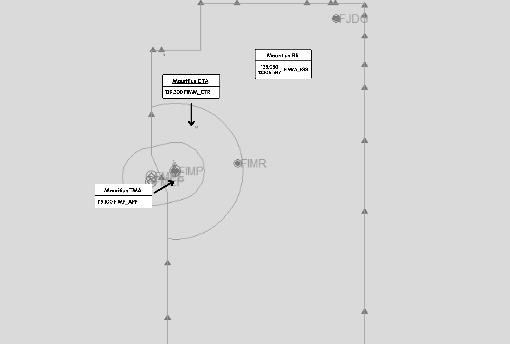

# 1. Overview

*IRL, the Mauritius CTA is listed as being under Mauritius APP. However, due to VATSIM limitations on range, this will need to be covered by FIMM_CTR instead. As such, for VATSIM purposes, Mauritius Approach only covers the physical Mauritius TMA instead.

## ATS Frequencies

| Position    | Callsign              | Frequency |       
| :---------: | :---------: | :---------: |
| FIMM_FSS | Mauritius Radio | 133.050 (HF: 13306 kHz) |
| FIMM_CTR    | Mauritius Centre    | 129.300 |

**If operating as FIMM_FSS, with FIMM_CTR offline, the controller should cross couple the 129.300 frequency in AfV to provide VHF coverage within the island of Mauritius.**

## ASSR Codes

**Domestic**

* 5300 - 5377

**International**

* 5600 - 5677

