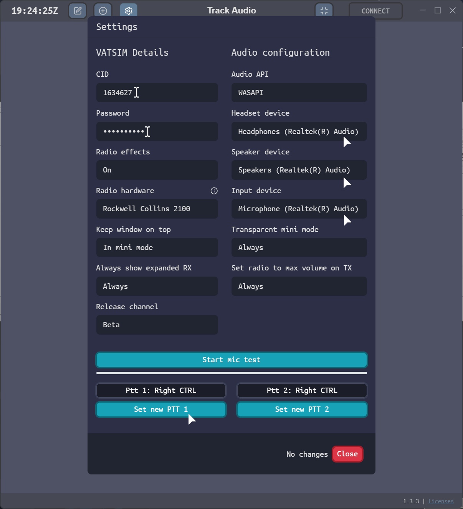
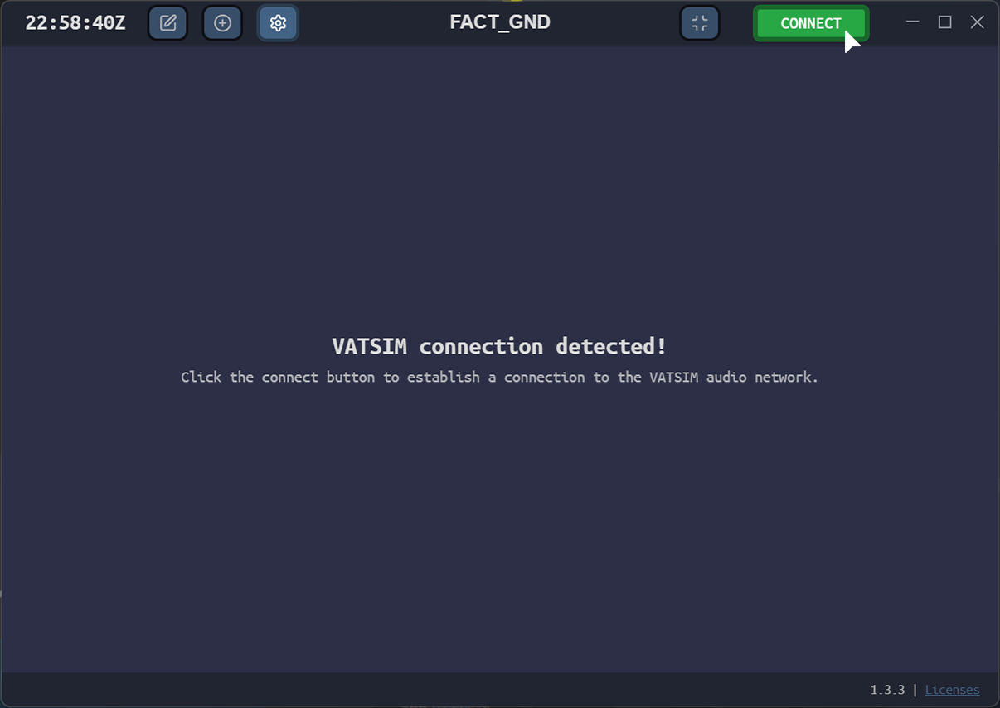
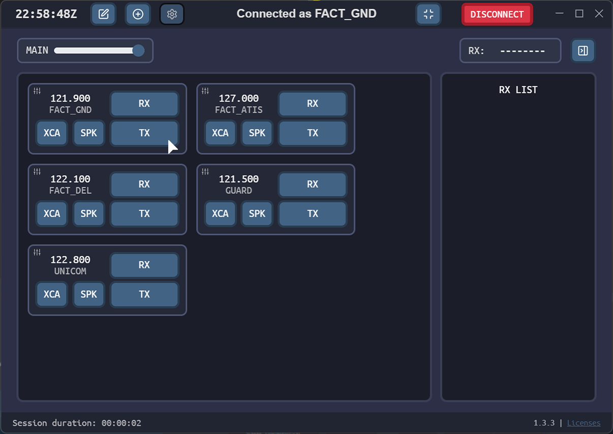
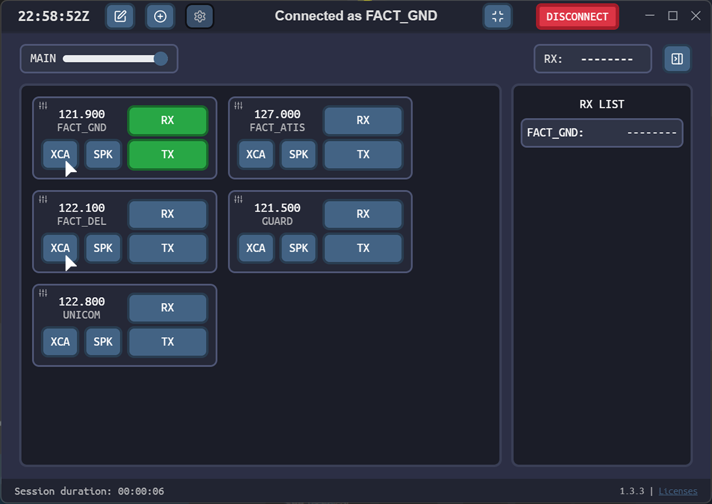

# TrackAudio - Controller Guide

## What is TrackAudio?
TrackAudio is a next generation Audio-For-VATSIM ATC Client for macOS, Linux and Windows.

Congratulations! You are now a fully fledged VATSIM controller. Now we need to talk to the aircraft we will be controlling on the network. In VATSSA we use TrackAudio as our recommended audio client. A controller guide for Audio for VATSIM can be found [here](insertlink).

Our resources page, where you can find the TrackAudio download link can be found [here](https://eaip2.vatssa.com/New-Controllers/Observing%20Guide/TrackAudio%20Guide%20-%20Observer/)

!!! info "Observer Guide"

    A guide for TrackAudio when observing on the network can be found [here](insertlink)

## Setting up TrackAudio

- Input your VATSIM Details
  * Your VATSIM CID
  * Your VATSIM Password
- Configure audio devices
  * Select a Headset, Speaker and Input device
- Set a Push-To-Talk (PTT) bind
- Save your changes by pressing 'Close' on the bottom right

## Connecting and Transmitting on Frequency

- Open TrackAudio, if setup correctly and connected to VATSIM you will see a green 'CONNECT' button.

- Once connected, you will see the position you have logged on as at the top. If your callsign is correct, then the frequencies will populate automatically.
- Click 'TX' (transmit) to both recieve and transmit on the selected frequency.
- Use your selected PTT button to transmit on the frequency.

## Cross-Coupling Frequencies

- To Cross-Couple (XC) a frequency, click on the XCA button of the frequencies you want to cross-couple.

Still having issues with TrackAudio? Feel free to ask for help in one of our channels in the VATSSA Discord server which can be found in the [VATSIM Community Server's](https://community.vatsim.net/)