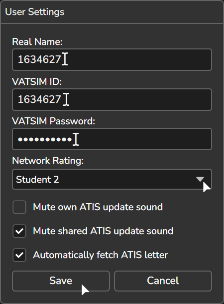
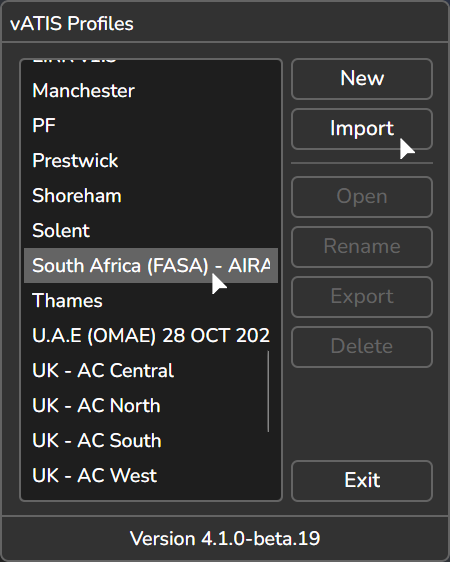
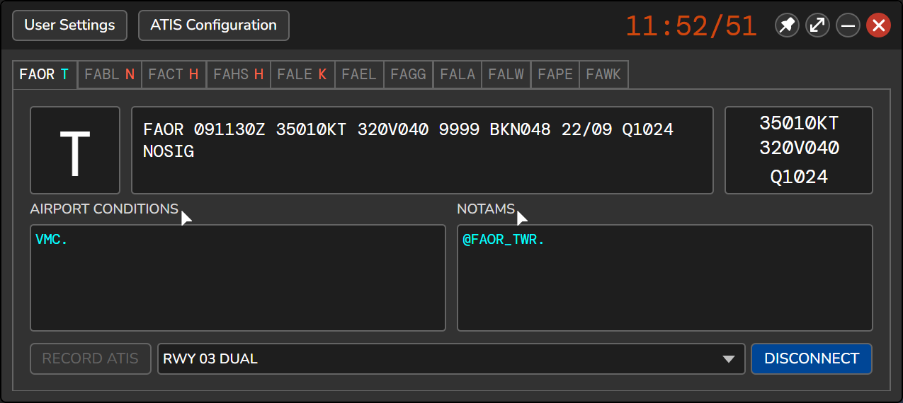

# vATIS Guide

## What is vATIS?
vATIS is an easy-to-use ATIS solution designed specifically for the VATSIM Network. It offers a simple and intuitive interface that allows users to create and broadcast ATIS messages quickly and easily.

Congrats on your new controller rating! To get started on controlling we want to connect an ATIS. An ATIS is a quick way to pass aerodrome information automatically.

!!! warning "VATSIM CoC"

    As per VATSIM CoC C7(a), any ATCS signed on as a Local Local (Tower), Ground, or Clearance Delivery should only provide an ATIS for their primary aerodrome. 
    
    Furthermore, an ATIS can only be connected if the real world counterpart has an ATIS. As a result, vATIS profiles are not made for all airports within our airspace

    More information, and all policies regarding ATIS connection can be found in the [VATSIM Code of Conduct](https://vatsim.net/docs/policy/code-of-conduct) and the  [ATC Frequency and Information Management Policy](https://cdn.vatsim.net/policy-documents/VATSIM%20ATC%20Frequency%20and%20Information%20Management%20Policy.pdf)

Our resources page, where you can find the vATIS profiles for all of the South African link can be found [here](https://eaip2.vatssa.com/New-Controllers/Observing%20Guide/TrackAudio%20Guide%20-%20Controller/)

## Setting up vATIS

- Input your VATSIM Details
  * Your Real Name
  * Your VATSIM CID
  * Your VATSIM Password
  * Your Network Rating

## Importing and Connecting an ATIS

- Open vATIS, press the 'Import' button then select the vATIS profile you have downloaded.
- Once imported, double click on the profile to open it.

- Once in the profile, select on the airport you are controlling.
- Open the presets dropdown, and select the optimal runway configuration.

- Once you have selected a preset, press the connect button the connect the ATIS to the VATISM network.

## Airport Conditions and NOTAMS

- Within VATSSA we utilise the vATIS Airport Conditions and NOTAMs features in our ATIS's. To select and choose any conditions that you may want, click on the AIRPORT CONDITION or NOTAMS text.

### Airport Conditions

Airport Conditions should be chosen on the current state of the airport. This can be dependent on Pilot Reports (PIREPS) or the METAR.

???+ info "Airport Conditions"

    ??? tip "VMC"

        **Text:** `EXP ZONE VMC.`
        **Voice:** `EXPECT ZONE V M C`

    ??? tip "IMC"

        **Text:** `EXP ZONE IMC.`
        **Voice:** `EXPECT ZONE EYE EM CEE`

    ??? tip "WINDSHEAR REPORTED"

        **Text:** `WINDSHEAR REPORTED`
        **Voice:** `WINDSHEAR REPORTED`

### NOTAMS

NOTAMS should be chosen depending on what controllers are currently controlling the aerodrome and the aerodrome condition.

???+ info "NOTAMS"

    ??? tip "@FAOR_DEL"

        **Text:** `CLEARANCE DELIVERY FREQUENCY 121 DECIMAL 7`
        **Voice:** `CLEARANCE DELIVERY FREQUENCY WUN TOO WUN DAY SEE MAL SEVEN`

    ??? tip "@FAOR_GND"

        **Text:** `CLEARANCE DELIVERY FREQUENCY 121 DECIMAL 9`  
        **Voice:** `CLEARANCE DELIVERY FREQUENCY WUN TOO WUN DAY SEE MAL NINER`

    ??? tip "@FAOR_TWR"

        **Text:** `CLEARANCE DELIVERY FREQUENCY 118 DECIMAL 1`
        **Voice:** `CLEARANCE DELIVERY FREQUENCY WUN WUN AIT DAY SEE MAL WUN`

    ??? tip "@FAOR_APP"

        **Text:** `CLEARANCE DELIVERY FREQUENCY 124 DECIMAL 5`
        **Voice:** `CLEARANCE DELIVERY FREQUENCY WUN TOO TREE DAY SEE MAL FIFE`

    ??? tip "@FAJA_CTR"

        **Text:** `CLEARANCE DELIVERY FREQUENCY 134 DECIMAL 4`
        **Voice:** `CLEARANCE DELIVERY FREQUENCY WUN TREE FOWER DAY SEE MAL FOWER`

    ??? tip "@FAJA_NW_CTR"

        **Text:** `CLEARANCE DELIVERY FREQUENCY 126 DECIMAL 7`
        **Voice:** `CLEARANCE DELIVERY FREQUENCY WUN TOO SIX DAY SEE MAL SEVEN`

    ??? tip "@FAJA_SW_CTR"

        **Text:** `CLEARANCE DELIVERY FREQUENCY 128 DECIMAL 3`
        **Voice:** `CLEARANCE DELIVERY FREQUENCY WUN TOO AIT DAY SEE MAL TREE`

    ??? tip "@FAJA_SE_CTR"

        **Text:** `CLEARANCE DELIVERY FREQUENCY 132 DECIMAL 150`
        **Voice:** `CLEARANCE DELIVERY FREQUENCY WUN TREE TOO DAY SEE MAL WUN FIFE ZERO`

    ??? tip "@FASA_CTR"

        **Text:** `CLEARANCE DELIVERY FREQUENCY 128.325`
        **Voice:** `CLEARANCE DELIVERY FREQUENCY WUN TOO AIT DAY SEE MAL TREE TOO FIFE`

    ??? tip "@666"

        **Text:** `RCR 6/6/6`
        **Voice:** `RUNWAY CONDITION REPORT SIX, SIX, SIX`

    ??? tip "@555"

        **Text:** `RCR 5/5/5`
        **Voice:** `RUNWAY CONDITION REPORT. FIVE, FIVE, FIVE`

    ??? tip "@444"

        **Text:** `RCR 4/4/4`
        **Voice:** `RUNWAY CONDITION REPORT. FOUR, FOUR, FOUR`

    ??? tip "@333"

        **Text:** `RCR 3/3/3`
        **Voice:** `RUNWAY CONDITION REPORT. THREE, THREE, THREE`

    ??? tip "@222"

        **Text:** `RCR 2/2/2`
        **Voice:** `RUNWAY CONDITION REPORT. TOO, TOO, TOO`

    ??? tip "@111"

        **Text:** `RCR 1/1/1`
        **Voice:** `RUNWAY CONDITION REPORT. FIVE, FIVE, FIVE`

    ??? tip "@000"

        **Text:** `RCR 0/0/0`
        **Voice:** `RUNWAY CONDITION REPORT. ZERO, ZERO, ZERO`

Still having issues with vATIS? Feel free to ask for help in one of our channels in the VATSSA Discord server which can be found in the [VATSIM Community Server's](https://community.vatsim.net/)