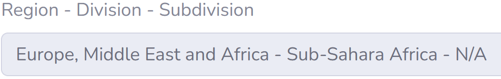
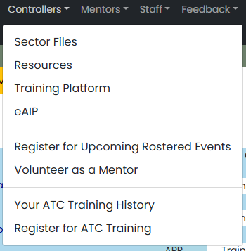
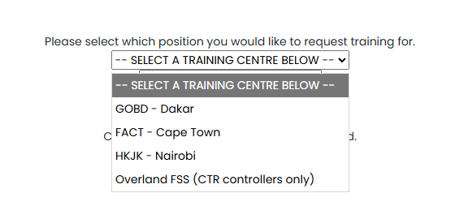
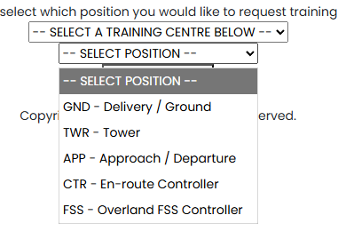

# Getting Started

## Signing Up
Before signing up, members must first be a "home member" of the VATSSA Division. 
To check if you are a home member, head to https://my.vatsim.net/profile - and check for Region - Division - Subdivision.

**It must look like the image below.**

Should it not match the image as above, this will mean you are not part of the VATSSA Division, and would need to transfer as a result should you wish to pursue training.

!!! warning
    Members should only consider transferring to the Division if they are genuinely committed to pursuing the training and are willing to actively participate within the division.

    Requests that are made without any true intention of actively participating in the division will slow the process down for everyone involved, and may hinder those who are actively willing to participate. 
    Please take this into account before submitting your transfer request, whether you will actually be willing to contribute actively to the division. 
    
    **VATSSA, and any other division should not be treated as a method to gain a quick rating before transferring back to your original division. This will cause longer waittimes for you in your original division should you transfer back and is disrespectful to all those involved.**

    If you have transferred within the last 90 days at the time of the application, then we are unable to process your transfer, this is something that can not be waived.

## Joining the Waitlist
Now, you've navigated the first hurdle, you've joined VATSSA, and are now a Home Member waiting to start training!

To begin, head to the [VATSSA Website](https://vatssa.com/hq/welcome.php) - and then Navigate under Controllers -> Register for ATC Training

Thereafter, select a Training Centre that you wish to train at. **Do not select Overland FSS, this is for C1+ controllers only.**

Thereafter, for position, select Delivery / Ground.

Once that is all done, submit your request with the button! And now you have signed up. 
If you haven't done so already, one crucial step is to join our Discord. This can be done via the [VATSIM Community Server](https://community.vatsim.net/)

That's all you need to do for now! In the meantime, feel free to check through the Software Page to see what you need to set up in preparation for the sessions and the training that lay ahead of you!